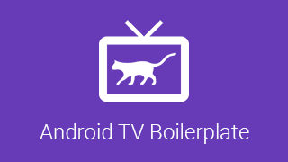
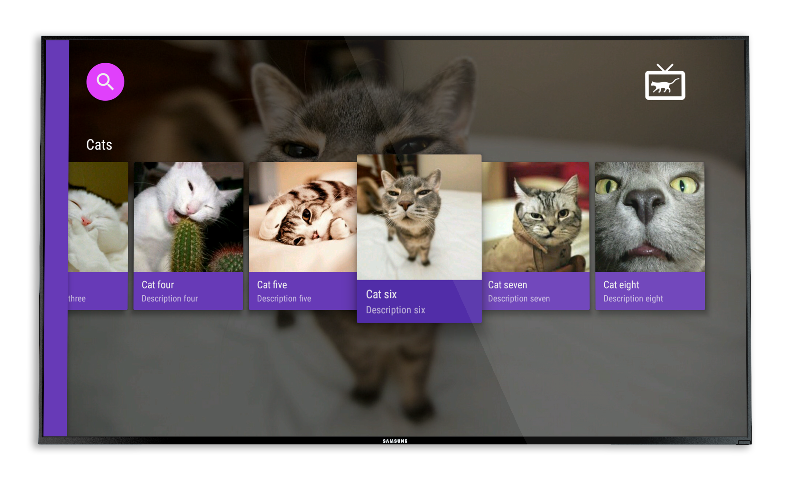
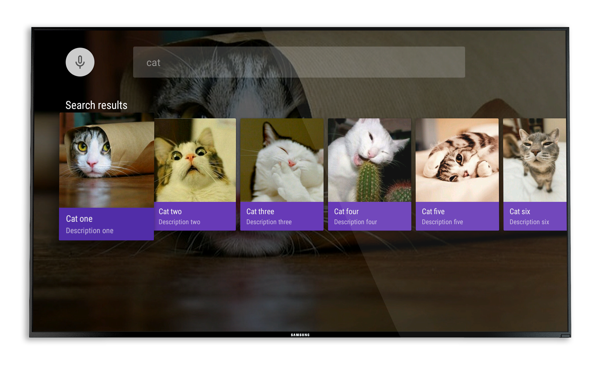

#Android TV Boilerplate
[](https://travis-ci.org/hitherejoe/AndroidTvBoilerplate)
=======================

<p align="center">
    
</p>

This is an Android TV Boilerplate project which should make it easy for you to get started when
wanting to create your own application for the Android TV platform!

The project is setup using:

- MVP architecture
- Functional tests with [Espresso](http://google.github.io/android-testing-support-library/docs/espresso)
- Unit tests with [Mockito](http://mockito.org/)
- [Checkstyle](http://checkstyle.sourceforge.net/), [FindBugs](http://findbugs.sourceforge.net/) and [PMD](https://pmd.github.io/)
- [Leanback Library](http://developer.android.com/tools/support-library/features.html#v17-leanback)
- [Recommendation Library](http://developer.android.com/tools/support-library/features.html#recommendation)
- [RxJava](https://github.com/ReactiveX/RxJava) and [RxAndroid](https://github.com/ReactiveX/RxAndroid)
- [Retrofit](http://square.github.io/retrofit/) and [OkHttp](https://github.com/square/okhttp)
- [Dagger 2](http://google.github.io/dagger/)
- [Butterknife](https://github.com/JakeWharton/butterknife)
- [Timber] (https://github.com/JakeWharton/timber)
- [Mockito](http://mockito.org/)
- [Glide](https://github.com/bumptech/glide)

The boilerplate currently has two core screens implemented and ready to feed data into:

##Browse

<p align="center">
    
</p>

##Search
<p align="center">
    
</p>

#Check

To check the code style and run unit tests:

```./gradlew check```

#Building

To build, install and run a debug version, run this from the root of the project:

```./gradlew assembleDebug```

#Unit Tests

To run the unit tests for the application:

```./gradlew testDebugUnitTest```

#User Interface Tests

To run the user interface tests for the application:

```./gradlew connectedDebugAndroidTest```
